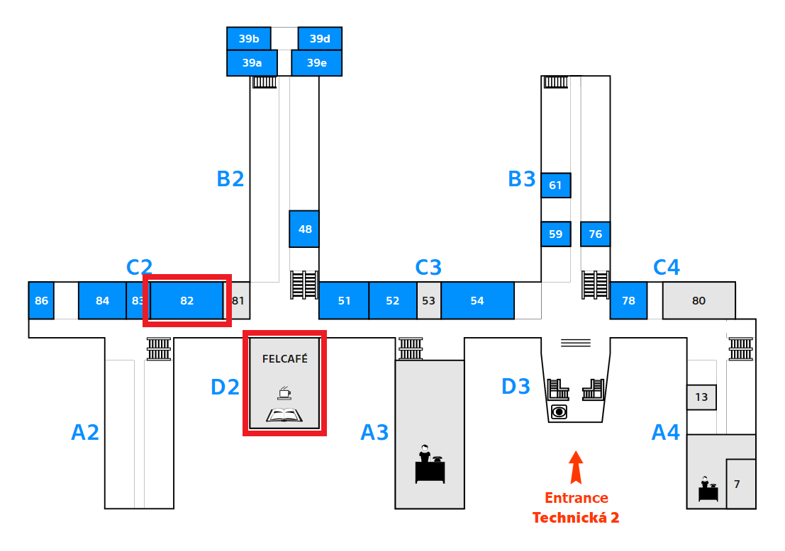

# SIGEVO     SUMMER     SCHOOL 2019

[SIGEvo](https://sigevo.org) Summer School 2019 in Prague, Czech Republic, back-to-back with
[GECCO 2019](http://gecco-2019.sigevo.org/). This page is also
published in [https://sigevo-summer-school-2019.github.io/](http://www.fel.cvut.cz/en/faculty/position.html)

## Dates

July 10-12 (plus GECCO tutorials/workshops 13-14). It will take
place in the Czech Technical University in Prague the days before the conference, with
access to GECCO tutorials for those that have not registered for GECCO too.

## Description

SIGEVO is a special interest group of ACM always looking for new ways
to enlarge the community of researchers working in different
biologically inspired metaheuristics. The third SigEvo Summer School
(S3), held in conjunction with GECCO 2019 in Prague, is looking for
students.

The core of the third S3 will take place in Prague in the days
previous to the conference, and will continue with tutorials the two
first days of GECCO, although the bulk of the school will finish right
before GECCO. That way, students will be able
to enjoy and learn during the conference proper without the burden of
having to work on the S3 projects. GECCO tutorials and 
workshops will be an integral part of the S3. You
can [register now](http://www.cvent.com/d/66q2lw/4W) in the GECCO
registration site.

Students are expected to:

- Bring their own laptops to work on the projects.

- Attend the three days of the summer school, as well as some
  tutorials and workshops the two first days of GECCO.

- Have a valid registration for the summer school. You can register
  independently (with free access to tutorials and workshops) or
  together with GECCO for a small additional fee.

- Cooperatively work on an assignment and follow the standards of
    proper social and research behavior.
	
- Deliver, by the end of S3, a paper and presentation on what they
  have been working on during it. 

Students of the S3 will be eligible for travel, register and lodging
grants of GECCO.

We specially encourage women and minorities to apply for this summer
school, where everyone is welcome. 

## Faculty/mentors

This year we'll have a great set of mentors, that will deliver some
lectures and also help to mentor the students in groups:

* Anna I Esparcia-Alcázar, Universitat Politècnica de València, Spain
* Penousal Machado, Universidade de Coimbra, Portugal
* JJ Merelo, Universidad de Granada, Spain
* Mike Preuss, University of Leiden, the Netherlands
* Marc Schoenauer, INRIA, France

## Venue

Czech Technical University, Faculty of Electrical Engineering, which
is in campus
Dejvice. [This page](http://www.fel.cvut.cz/en/faculty/position.html)
describes where the summer school is going to take place.

There is a neighboring metro station Dejvicka, which is on the way
from the airport to the city center.

We will be working in two rooms:

* FELcafe, which will be used for group work 
* Room 82, mainly for presentations. 

Here's a floorplan of the site with the position of both rooms.

The first day we will meet at Room 82.

## Projects

We will be asking you to get into groups of maximum 5 people and work on a project of your choice.

Project ideas this year should ideally be based on the UN's Sustainable Development Goals, https://www.un.org/sustainabledevelopment/ but they can also be related to anything from your own experience.

A few ideas (please add your own)

- SDG #2 *Zero hunger*: Can we fix food waste using our algorithms?
- SDG #3 Good health and well-being: Can we avoid Alzheimer’s?
- SDG #5 *Gender Equality*: what can we do to solve algorithmic gender bias?
- SDG #14 *Life below water*: What can we do to remove plastic from the sea? 
- SDG #16 *Peace, justice and strong institutions* (well, sort of): How to detect fake news, images and videos? 

#### References
- Food waste: https://stats.oecd.org/Index.aspx?DataSetCode=FOOD_WASTE; https://www.freecodecamp.org/news/how-we-reduced-food-wastage-and-saved-money-using-machine-learning-c462aa5a3b30/
- Sea plastic: http://plasticadrift.org/; https://app.dumpark.com/seas-of-plastic-2/; http://odinafrica.org/about-us/news/217-90-percent-of-ocean-plastic-waste-comes-from-asia-and-africa.html
- Fake news data:  http://www.fakenewschallenge.org or https://www.kaggle.com/c/fake-news)

## Schedule

We will meet on July 10th in the venue, initially in Room 82.

- *July 10th*: presentation, group dynamics and presentation of group
  tools, scientific programming and visualization tools. Team building
  and design thinking session for elaboration of projects at the end
  of the day. Group presentation and mentoring choice and
  assignment.

- *July 11th*: Mentors working with teams for on-demand talks and
  tutorials. Short presentations in the afternoon, and personal
  tutoring sessions.
- *July 12*: lunchtime general meeting, and afternoon hackathon,
  presentation editing and delivery.
- *July 13-14*: students might attend to tutorials of their choice.

Activities will run from 9 to five, with an hour pause for a working
lunch at 12:30. Detailed timetable below

### July 10th

We will meet at room 82 of the Faculty of Electrical Engineering,
campus Dejvice

* 9-10 : Welcome and meet & greet
* 10-10:30 : Introduction to the summer school, presentation of the
  program by JJ Merelo
* 10:30-11:00 : Coffee break
* 11:00 - 12:30: Challenges in evolutionary computation by Marc
  Schoenauer
* 12:30 - 13:30: lunch pause
* 13:30 - 14:30: The role of Evolutionary Computation in Game AI -
  Mike Preuss
* 14:30 - 15:30: Evolutionary Art - Penousal Machado
* 15:30 - 16:00: Coffee break
* 16:00 - 17:00: [Make your poster presentations awesome](https://www.flickr.com/photos/atalaya/albums/72157709551888481) - JJ Merelo
  
### July 11th

We will meet initially at room 82 of the Faculty of Electrical Engineering,
campus Dejvice

* 9-10 : Open Science, free software and evolutionary computation by JJ Merelo
* 10-10:30 : Coffee break
* 10:30 - 12:30: Design thinking session to design projects by Anna Esparcia
* 12:30 - 13:30: lunch pause
* 13:30 - 14:30: Project pitch and project election
* 14:30 - 17:00: Move to FELcafe and start teamwork on projects.

### July 12th

Meeting at FELCafe

* 9-15 Work on project and project presentation, with pause for coffee
  and lunch (or continue working on projects)
* 15:00 move back to Room 82, start presentations by every team.

### July 13-14th

GECCO tutorials and workshops, as advised by mentors, taking place at
[GECCO venue](https://gecco2019.sigevo.org).

## More information

Any comments or questions on the school organization, please contact
JJ Merelo (jmerelo@ugr.es <mailto:jmerelo@ugr.es>)

